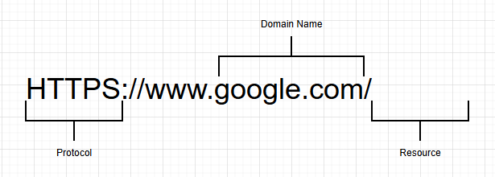

# udemy_frontend_learning

## Section1: Introduction

#### URL-Uniform Resource Locator





How web works:


This diagram shows a simple client–server communication flow:

1.Client (IP Address) sends an HTTP Request to the Server (identified by its DNS).

2.Server processes the request and sends back an HTTP Response to the Client.

#### HTTP: Hypertext Transfer Protocol.
Communication language of the client and server.

## Section2:

list of common HTML tags and their purposes:

**Structure & Document Setup**

```
<html> – Root element of an HTML page.

<head> – Contains metadata, title, styles, and scripts.

<title> – Sets the page title in the browser tab.

<body> – Contains the visible page content.
```

**Text Formatting**

```
<h1> to <h6> – Headings (h1 is largest, h6 is smallest).

<p> – Paragraph.

<br> – Line break.

<hr> – Horizontal line.

<strong> – Bold, important text.

<em> – Italic, emphasized text.

<span> – Inline text container.
```

**Links & Media**

```

<a> – Hyperlink.

 – Image.

<video> – Video file.

<audio> – Audio file.
```

**Lists**

```

<ul> – Unordered list.

<ol> – Ordered list.

<li> – List item.

<dl> - Defination List.
```

**Tables**
```

<table> – Table container.

<tr> – Table row.

<th> – Table header.

<td> – Table data.

```
**Forms**

```
<form> – Form container.

<input> – Input field.

<textarea> – Multiline text input.

<button> – Button element.

<select> – Dropdown list.

<option> – Dropdown option.
```

**Layout & Semantics**

```
<div> – Block-level container.

<header> – Page or section header.

<nav> – Navigation links.

<main> – Main content area.

<section> – Thematic grouping of content.

<article> – Independent content block.

<footer> – Page or section footer.
```

<hr>

### Tags Attributes:
**1. Global Attributes:**

```
<p id="intro">Hello</p>
<div class="box"></div>
<h1 style="color:red;">Title</h1>
<p hidden>Not visible</p>
<p lang="en">Hello</p>
```

**2.Anchor (< a >):**
```
<a href="https://www.google.com">Visit</a>  
<a href="x" target="_blank">New Tab</a>  
<a rel="nofollow">Link</a>
```

**3.Image (< img >):**
```
  
  


src="images/landscape.jpg" alt="landscope",height="200" width="400" title="A Nice Image" />
     <figcaption>Fig 1- A Nice Landscope</figcaption>
```
**4.Input (< input >):**
```
<input type="text">  
<input name="username">  
<input value="nipa">  
<input placeholder="Enter name">  
<input required>  
<input readonly>  

```

**5.Table (< table >)**
```
<table border="1">  
<table cellpadding="5">  
<table cellspacing="2">

```

### Meta Tags:
list of common HTML <meta> tags with examples:
```
| Meta Tag Purpose                   | Example                                                                     |
| ---------------------------------- | --------------------------------------------------------------------------- |
| Charset (character encoding)       | `<meta charset="UTF-8">`                                                    |
| Viewport (responsive design)       | `<meta name="viewport" content="width=device-width, initial-scale=1.0">`    |
| Description (SEO description)      | `<meta name="description" content="This is a sample website.">`             |
| Keywords (SEO keywords)            | `<meta name="keywords" content="HTML, CSS, JavaScript">`                    |
| Author                             | `<meta name="author" content="John Doe">`                                   |
| Robots (search engine indexing)    | `<meta name="robots" content="index, follow">`                              |
| Refresh (auto refresh/redirect)    | `<meta http-equiv="refresh" content="30">`                                  |

```
### Text Emphasis Tags:
List of HTML text emphasis tags with their purpose and examples, suitable for reference:
```
| Tag        | Purpose                                             | Example                                   |
| ---------- | --------------------------------------------------- | ----------------------------------------- |
| `<b>`      | Bold text (stylistic, no extra importance)          | `<b>This text is bold</b>`                |
| `<strong>` | Important text (semantic emphasis, usually bold)    | `<strong>This text is important</strong>` |
| `<i>`      | Italic text (stylistic, no extra importance)        | `<i>This text is italic</i>`              |
| `<em>`     | Emphasized text (semantic emphasis, usually italic) | `<em>This text is emphasized</em>`        |
| `<mark>`   | Highlighted text                                    | `<mark>This text is highlighted</mark>`   |
| `<small>`  | Smaller text                                        | `<small>This text is smaller</small>`     |
| `<del>`    | Deleted/strikethrough text                          | `<del>This text is deleted</del>`         |
| `<ins>`    | Inserted/underlined text                            | `<ins>This text is inserted</ins>`        |
| `<sub>`    | Subscript text                                      | `H<sub>2</sub>O`                          |
| `<sup>`    | Superscript text                                    | `x<sup>2</sup>`                           |

```

### Block VS Inline Elements:

```
| Property          | Block Elements                                     | Inline Elements                             |
|-------------------|----------------------------------------------------|----------------------------------------------|
| Width             | Occupies the full width of its parent container    | Occupies only as much width as needed        |
| Line Break        | Always starts on a new line                        | Does not start on a new line                 |
| Containment       | Can contain block and inline elements              | Usually contains only inline elements        |
| Height & Width    | Can be set using CSS                               | Height and width usually have no effect      |
| Example Tags      | `<div>`, `<p>`, `<h1>`–`<h6>`, `<section>`, `<ul>` | `<span>`, `<a>`, `<strong>`, `<em>`, `` |

```

### HTML Entities:
Some common HTML Entities

```
| Entity Name | Symbol | Description |
|-------------|--------|-------------|
| `&lt;`      | <      | Less than sign |
| `&gt;`      | >      | Greater than sign |
| `&amp;`     | &      | Ampersand |
| `&quot;`    | "      | Double quotation mark |
| `&apos;`    | '      | Apostrophe / single quote |
| `&nbsp;`    |        | Non-breaking space |
| `&copy;`    | ©      | Copyright symbol |
| `&reg;`     | ®      | Registered trademark |
| `&trade;`   | ™      | Trademark |
| `&cent;`    | ¢      | Cent sign |
| `&pound;`   | £      | Pound sterling |
| `&yen;`     | ¥      | Yen sign |
| `&euro;`    | €      | Euro sign |
| `&deg;`     | °      | Degree symbol |
| `&plusmn;`  | ±      | Plus-minus sign |
| `&divide;`  | ÷      | Division sign |
| `&times;`   | ×      | Multiplication sign |
| `&sup2;`    | ²      | Superscript 2 |
| `&sup3;`    | ³      | Superscript 3 |

```

### Sementic Elements:

```
| Element        | Purpose                                            |
| -------------- | ------------------------------------------------------ |
| `<header>`     | Defines a header for a page or section.                |
| `<nav>`        | Defines navigation links.                              |
| `<main>`       | Defines the main content of the document.              |
| `<section>`    | Defines a standalone section of content.               |
| `<article>`    | Defines independent, self-contained content.           |
| `<aside>`      | Defines content aside from the main content (sidebar). |
| `<footer>`     | Defines footer for a page or section.                  |
| `<figure>`     | Defines self-contained content, often with an image.   |
| `<figcaption>` | Defines a caption for `<figure>`.                      |
| `<address>`    | Defines contact information for author/owner.          |
| `<time>`       | Defines a date or time.                                |

```

## Section3:

**1. < form > Element:**
The container for all form elements. It defines how data is sent and to where.

Attributes:

**action** → URL to send form data.<br>
**method** → GET or POST (how data is sent).
```
<form action="/submit" method="post">
      <input type="text" name="username" placeholder="Enter username">
</form>
```

**2. < input >** Elements Types:

Used for various types of user input.

**Common type values:**<br>

**text** → single-line text<br>
**password** → password input<br>
**email** → email input<br>
**number** → numeric input<br>
**checkbox** → checkboxes<br>
**radio** → radio buttons<br>
**submit** → submit button<br>
**file** → file upload<br>
**tel** → telephone number<br>
**url** → URL input<br>
**date** → date picker<br>
**time** → time picker<br>
**datetime-local** → local date & time picker<br>
**month** → month picker<br>
**week** → week picker<br>
**color** → color picker<br>
**range** → slider for numeric range<br>
**hidden** → hidden input (not visible)<br>
**reset** → reset button<br>
**button** → generic clickable button<br>
**image** → image as submit button<br>
```
<input type="text" name="username" placeholder="Enter username">
<input type="password" name="password">
<input type="submit" value="Login">

```

### Text Based Inputs attributes:

**type** → defines input type, e.g., text

**name** → name of the input, used when submitting form data

**id** → unique identifier, often linked with <label>

**placeholder** → hint text shown inside the input

**value** → default value of the input

**maxlength** → maximum number of characters allowed

**required** → makes the field mandatory

**readonly** → user cannot edit the value

**disabled** → field is disabled, cannot be edited or submitted

**autocomplete** → suggests previous input values

**autofocus** → automatically focuses input when page loads


<hr>

### Section 4:
**SVG Elements:** SVG stands for Scalable Vector Graphics.<br>

**Basic Concept :**

**Scalable**: You can resize without pixelation (perfect for responsive design).

**Vector-based:** Uses points, lines, curves, and shapes, not pixels.

**Text-based:** You can write it in code (XML), so it’s editable and searchable.

**Lightweight**: Smaller file sizes for simple graphics compared to images.

**Styling**: Can be styled with CSS or manipulated with JavaScript.

**Interactive**: Supports animations and events.

```
<svg> — Container for SVG graphics.

<circle> — Draws a circle (cx, cy = center, r = radius).

<rect> — Draws a rectangle.

<line> — Draws a line.

<text> — Adds text inside SVG.
```

<hr>

### Section 5:
**CSS (Cascading Style Sheets) – Basic Concept:**
HTML builds the structure of a webpage, and CSS makes it look attractive.

**CSS Does:**

Change text color, font, and size

Add background colors and images

Control margin, padding, and borders

Create layouts (using Grid, Flexbox, etc.)

Make websites responsive (adapt to mobile, tablet, desktop)


**Three Ways to Use CSS:**<br>

**1.Inline CSS** → Written inside the HTML tag using the style attribute.
```
<p style="color:red; font-size:20px;">Hello CSS</p>
```
**2.Internal CSS** → Written inside a < style > tag in the HTML <head>.

```
<head>
  <style>
    p {
      color: blue;
      font-size: 18px;
    }
  </style>
</head>

```

**3.External CSS** → Written in a separate .css file and linked using <link>.
```
<link rel="stylesheet" href="style.css">

```

### Serif vs Sans-Serif Fonts:
```
| Feature         | Serif                                 | Sans-Serif                |
| --------------- | ------------------------------------- | -------------------------------- |
| Definition      | Has small decorative strokes (serifs) | No decorative strokes (clean)    |
| Style           | Traditional, formal, elegant          | Modern, simple, minimal          |
| Best Use        | Print (books, newspapers, magazines)  | Digital screens (websites, apps) |
| Readability     | Better for long printed texts         | Better for screens & short texts |
| Examples        | Times New Roman, Georgia, Garamond    | Arial, Helvetica, Verdana        |

```

#### Where to use colors:

1. Text Color

Change the color of the text inside elements like headings, paragraphs, links, etc.

```
p {
  color: blue; /* Text becomes blue */
}
h1 {
  color: #ff5733; /* Text in hex color */
}

```

2. Background Color

Set background for the whole page, sections, divs, buttons.
```
body {
  background-color: lightgray;
}
div {
  background-color: #f0f0f0;
}
button {
  background-color: green;
  color: white; /* Text color on button */
}

```
3. Borders

Colors can be applied to borders of boxes or elements.
```
div {
  border: 2px solid red; /* Red border */
}

```
4. Links

Style different states of links: normal, hover, visited, active.
```
a:link {
  color: blue;
}
a:hover {
  color: red;
}

```

5. Shadows

Text or box shadows can use color to add depth.
```
p {
  text-shadow: 2px 2px 5px gray;
}
div {
  box-shadow: 5px 5px 10px rgba(0,0,0,0.3);
}

```

6. Gradients

Colors can be used in linear or radial gradients.
```
div {
  background: linear-gradient(to right, red, yellow);
}

```

7. Forms & Buttons

Input fields, buttons, and hover states often use colors for usability and attention.
```
input[type="text"] {
  background-color: #f9f9f9;
  border: 1px solid #ccc;
}
button:hover {
  background-color: #ff6600;
  color: white;
}

```

8.Fill in SVG

The fill property sets the inside color of SVG shapes like <circle>, <rect>, <ellipse>, <polygon>, etc.
<br>**Fill in CSS**<br>
For HTML elements, the background-color acts like a fill.
```
div {
  width: 150px;
  height: 100px;
  background-color: orange; /* fills the interior of the div */
}

```

**1. What is RGB?**

RGB stands for Red, Green, Blue.

Colors are created by mixing these three primary colors in different amounts.

Each color component can have a value from 0 to 255.

**Syntax**
```
color: rgb(red, green, blue);

```
**red** → intensity of red (0–255)

**green** → intensity of green (0–255)

**blue** → intensity of blue (0–255)

**RGBA (with transparency)**

rgba(red, green, blue, alpha) → alpha = opacity (0 = transparent, 1 = fully visible).

```
p { color: rgba(255, 0, 0, 0.5); } /* Semi-transparent red */

```

**What is HSL?**

HSL stands for Hue, Saturation, and Lightness.

An alternative to RGB for defining colors.

Can also use HSLA to include transparency.

**Syntax**
```
color: hsl(hue, saturation%, lightness%);

```
**Hue** → color type (0–360° on the color wheel)

0° = Red, 120° = Green, 240° = Blue

**Saturation** → intensity of the color (0% = gray, 100% = full color)

**Lightness** → brightness (0% = black, 50% = normal, 100% = white)

HSLA (with transparency):

```
p { color: hsla(120, 100%, 50%, 0.5); } /* Semi-transparent green */

```
a = alpha channel (0 = fully transparent, 1 = fully visible)


### Section6:
**CSS Box Model Properties:**

Every HTML element is treated as a box in CSS. The box model is made up of four main parts:

**1.Content**<br>
The actual text or image inside the element.

Controlled with width and height.

**2.Padding**<br>
The space between the content and the border.

Creates inner spacing inside the element.

Example: padding: 10px;

**3.Border**<br>
The line that goes around content + padding.

You can set thickness, style, and color.
Example: border: 2px solid black;

**4.Margin**<br>
The space outside the border, separating the element from others.

Creates outer spacing.
Example: margin: 20px;
<br>

**Box Model Diagram:**


```
 -------------------------
|        Margin           |
|  ---------------------  |
|  |      Border       |  |
|  |  ---------------  |  |
|  |  |   Padding   |  |  |
|  |  | ----------- |  |  |
|  |  |  Content   |  |  |
|  |  | ----------- |  |  |
|  |  ---------------  |  |
|  ---------------------  |
 -------------------------

```

**Some example of sub propertities:<br>**
```
| Property    | Sub-properties                                                                                      |
| ----------- | --------------------------------------------------------------------------------------------------- |
| Margin      | margin-top, margin-right, margin-bottom, margin-left                                                |
| Padding     | padding-top, padding-right, padding-bottom, padding-left                                            |
| Border      | border-top, border-right, border-bottom, border-left, <br> border-width, border-style, border-color |
| Content     | width, height, min-width, max-width, min-height, max-height                                         |

```

### Position Property:

```
| Position Value    | Description                                                                                                                         |
| ----------------- | --------------------------------------------------------------------------------------------------------------------------------------- |
|  static           | Default value. The element is positioned according to the normal flow of the document. `top`, `right`, `bottom`, `left` have no effect. |
|  relative         | The element is positioned relative to its normal position. `top`, `right`, `bottom`, `left` offsets move it from that position.         |
|  absolute         | The element is positioned relative to its nearest positioned ancestor (not `static`). It is removed from the normal flow.               |
|  fixed            | The element is positioned relative to the viewport. It stays in place even when scrolling. Removed from normal flow.                    |
|  sticky           | The element toggles between `relative` and `fixed` depending on the scroll position. It “sticks” within its parent container.           |

```

### Section 7:

**Why Flexbox?**

Before Flexbox, developers mostly used float, table, or inline-block hacks to align items, which was messy. Flexbox solves this by giving us powerful alignment tools in both row and column directions.

**Main Features of Flexbox**

**1.Direction control**

--flex-direction: row; (default → items in a row, left to right)

--flex-direction: column; (stack items top to bottom)

**Alignment along the main axis (row or column)**

-- justify-content: flex-start | flex-end | center | space-between | space-around | space-evenly;

**Alignment along the cross axis (opposite direction)**

 -- align-items: flex-start | flex-end | center | stretch | baseline;

**Wrapping**

-- flex-wrap: wrap; (items wrap to the next line if no space)

**Flexible item sizes**

 -- flex: grow shrink basis; (controls how items expand/shrink)


#### Justify Content and Align-items:

**justify-content (align along the main axis)**

```
.container {
  display: flex;
  justify-content: flex-start;   /* items at the start (default) */
  justify-content: flex-end;     /* items at the end */
  justify-content: center;       /* items in the center */
  justify-content: space-between;/* items spread out, first at start, last at end */
  justify-content: space-around; /* equal space around each item */
  justify-content: space-evenly; /* equal space between all items */
}

```
**align-items (align along the cross axis)**
```
.container {
  display: flex;
  align-items: stretch;    /* default: items stretch to container’s height */
  align-items: flex-start; /* items aligned at the top */
  align-items: flex-end;   /* items aligned at the bottom */
  align-items: center;     /* items aligned in the middle */
  align-items: baseline;   /* items aligned by text baseline */
}

```

## Section 8: Responsive Design:

Responsive design is a web design approach that ensures websites and applications automatically adjust their layout, content, and functionality to provide an optimal viewing and interaction experience across different devices and screen sizes.

**Common components of responsive design:**

**Fluid Grid Layouts** – Use percentage-based widths instead of fixed pixels so elements scale with screen size.

**Flexible Images & Media** – Images and videos resize automatically to fit their containers.

**Media Queries** – CSS rules that apply different styles for different screen widths (e.g., mobile vs. desktop).

**Viewport Meta Tag** – Ensures the browser displays the page correctly on mobile devices.

**Mobile-First Design** – Designing for smaller screens first, then enhancing for larger screens.

**Responsive Typography** – Font sizes and line spacing adjust to remain readable on all devices.

**Navigation Adaptation** – Menus transform into dropdowns or hamburger menus on small screens.

**Breakpoints** – Predefined screen widths (e.g., 1200px, 992px, 768px, 480px) where the layout changes.

#### em and rem units:

##### em
em is relative to the font-size of the parent element.

1em = parent element’s font-size.

```
.parent {
  font-size: 20px;
}
.child {
  font-size: 2em; /* = 40px (20 × 2) */
}

```

### rem
**rem means root em** → it is always relative to the root element (html) font-size.

1rem = html element’s font-size (usually default = 16px).

```
html {
  font-size: 16px;
}
.child {
  font-size: 2rem; /* = 32px (16 × 2), independent of parent */
}

```

#### vh and vw units in CSS:

**vh (viewport height)**

vh is relative to the height of the viewport (the visible area of the browser window).

1vh = 1% 
```
div {
  height: 50vh;
  background-color: lightblue;
}

```

**vw (viewport width)**

vw is relative to the width of the viewport.

1vw = 1% of viewport width.
```
div {
  width: 80vw; /* 80% of the browser window width */
  background-color: lightgreen;
}

```

## Section:10

#### CSS Customs properties:

CSS Custom Properties (commonly called CSS Variables) are user-defined values that begin with a 
double hyphen (--) and can be reused throughout a stylesheet. They allow you to store values (like colors, fonts, sizes, spacing) in one place and access them anywhere in your CSS using the var() function.

**Why do we use CSS Custom Properties (CSS Variables)?**

CSS Custom Properties (also known as CSS Variables) are mainly used to store frequently used values (like colors, font sizes, spacing, etc.) in one place. 
This makes the code cleaner and makes changes much easier.

**When do we use them?**

**When the same value is used repeatedly**

Suppose your site’s primary color is #3498db.

If you use that color in many places, later if you want to change it, updating it everywhere one by one is difficult.

With a custom property, you just change it in one place and it updates everywhere.

**For creating Dark Mode / Light Mode themes**

If theme-based colors or styles are stored in separate --variables, it becomes very easy to switch themes.

**For reusable and maintainable code**

You don’t have to write the same value again and again.

In large projects, managing styles becomes much easier.

**For changing styles dynamically with JavaScript**

Custom properties can easily be updated from JavaScript. For example, clicking a button can change the color or size instantly.

Example:
```
:root {
  --main-color: #3498db;
  --font-size: 16px;
}

p {
  color: var(--main-color);
  font-size: var(--font-size);
}

```