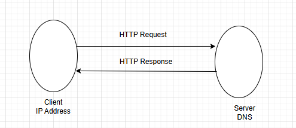

# udemy_frontend_learning

## Section1: Introduction

#### URL-Uniform Resource Locator


How web works:



This diagram shows a simple client–server communication flow:

1.Client (IP Address) sends an HTTP Request to the Server (identified by its DNS).

2.Server processes the request and sends back an HTTP Response to the Client.

#### HTTP: Hypertext Transfer Protocol.
Communication language of the client and server.

## Section2:

list of common HTML tags and their purposes:

**Structure & Document Setup**

```
<html> – Root element of an HTML page.

<head> – Contains metadata, title, styles, and scripts.

<title> – Sets the page title in the browser tab.

<body> – Contains the visible page content.
```

**Text Formatting**

```
<h1> to <h6> – Headings (h1 is largest, h6 is smallest).

<p> – Paragraph.

<br> – Line break.

<hr> – Horizontal line.

<strong> – Bold, important text.

<em> – Italic, emphasized text.

<span> – Inline text container.
```

**Links & Media**

```

<a> – Hyperlink.

 – Image.

<video> – Video file.

<audio> – Audio file.
```

**Lists**

```

<ul> – Unordered list.

<ol> – Ordered list.

<li> – List item.

<dl> - Defination List.
```

**Tables**
```

<table> – Table container.

<tr> – Table row.

<th> – Table header.

<td> – Table data.

```
**Forms**

```
<form> – Form container.

<input> – Input field.

<textarea> – Multiline text input.

<button> – Button element.

<select> – Dropdown list.

<option> – Dropdown option.
```

**Layout & Semantics**

```
<div> – Block-level container.

<header> – Page or section header.

<nav> – Navigation links.

<main> – Main content area.

<section> – Thematic grouping of content.

<article> – Independent content block.

<footer> – Page or section footer.
```

<hr>

### Tags Attributes:
**1. Global Attributes:**

```
<p id="intro">Hello</p>
<div class="box"></div>
<h1 style="color:red;">Title</h1>
<p hidden>Not visible</p>
<p lang="en">Hello</p>
```

**2.Anchor (< a >):**
```
<a href="https://www.google.com">Visit</a>  
<a href="x" target="_blank">New Tab</a>  
<a rel="nofollow">Link</a>
```

**3.Image (< img >):**
```
  
  


src="images/landscape.jpg" alt="landscope",height="200" width="400" title="A Nice Image" />
     <figcaption>Fig 1- A Nice Landscope</figcaption>
```
**4.Input (< input >):**
```
<input type="text">  
<input name="username">  
<input value="nipa">  
<input placeholder="Enter name">  
<input required>  
<input readonly>  

```

**5.Table (< table >)**
```
<table border="1">  
<table cellpadding="5">  
<table cellspacing="2">

```

### Meta Tags:
list of common HTML <meta> tags with examples:
```
| Meta Tag Purpose                   | Example                                                                     |
| ---------------------------------- | --------------------------------------------------------------------------- |
| Charset (character encoding)       | `<meta charset="UTF-8">`                                                    |
| Viewport (responsive design)       | `<meta name="viewport" content="width=device-width, initial-scale=1.0">`    |
| Description (SEO description)      | `<meta name="description" content="This is a sample website.">`             |
| Keywords (SEO keywords)            | `<meta name="keywords" content="HTML, CSS, JavaScript">`                    |
| Author                             | `<meta name="author" content="John Doe">`                                   |
| Robots (search engine indexing)    | `<meta name="robots" content="index, follow">`                              |
| Refresh (auto refresh/redirect)    | `<meta http-equiv="refresh" content="30">`                                  |

```
### Text Emphasis Tags:
List of HTML text emphasis tags with their purpose and examples, suitable for reference:
```
| Tag        | Purpose                                             | Example                                   |
| ---------- | --------------------------------------------------- | ----------------------------------------- |
| `<b>`      | Bold text (stylistic, no extra importance)          | `<b>This text is bold</b>`                |
| `<strong>` | Important text (semantic emphasis, usually bold)    | `<strong>This text is important</strong>` |
| `<i>`      | Italic text (stylistic, no extra importance)        | `<i>This text is italic</i>`              |
| `<em>`     | Emphasized text (semantic emphasis, usually italic) | `<em>This text is emphasized</em>`        |
| `<mark>`   | Highlighted text                                    | `<mark>This text is highlighted</mark>`   |
| `<small>`  | Smaller text                                        | `<small>This text is smaller</small>`     |
| `<del>`    | Deleted/strikethrough text                          | `<del>This text is deleted</del>`         |
| `<ins>`    | Inserted/underlined text                            | `<ins>This text is inserted</ins>`        |
| `<sub>`    | Subscript text                                      | `H<sub>2</sub>O`                          |
| `<sup>`    | Superscript text                                    | `x<sup>2</sup>`                           |

```

### Block VS Inline Elements:

```
| Property          | Block Elements                                     | Inline Elements                             |
|-------------------|----------------------------------------------------|----------------------------------------------|
| Width             | Occupies the full width of its parent container    | Occupies only as much width as needed        |
| Line Break        | Always starts on a new line                        | Does not start on a new line                 |
| Containment       | Can contain block and inline elements              | Usually contains only inline elements        |
| Height & Width    | Can be set using CSS                               | Height and width usually have no effect      |
| Example Tags      | `<div>`, `<p>`, `<h1>`–`<h6>`, `<section>`, `<ul>` | `<span>`, `<a>`, `<strong>`, `<em>`, `` |

```

### HTML Entities:
Some common HTML Entities

```
| Entity Name | Symbol | Description |
|-------------|--------|-------------|
| `&lt;`      | <      | Less than sign |
| `&gt;`      | >      | Greater than sign |
| `&amp;`     | &      | Ampersand |
| `&quot;`    | "      | Double quotation mark |
| `&apos;`    | '      | Apostrophe / single quote |
| `&nbsp;`    |        | Non-breaking space |
| `&copy;`    | ©      | Copyright symbol |
| `&reg;`     | ®      | Registered trademark |
| `&trade;`   | ™      | Trademark |
| `&cent;`    | ¢      | Cent sign |
| `&pound;`   | £      | Pound sterling |
| `&yen;`     | ¥      | Yen sign |
| `&euro;`    | €      | Euro sign |
| `&deg;`     | °      | Degree symbol |
| `&plusmn;`  | ±      | Plus-minus sign |
| `&divide;`  | ÷      | Division sign |
| `&times;`   | ×      | Multiplication sign |
| `&sup2;`    | ²      | Superscript 2 |
| `&sup3;`    | ³      | Superscript 3 |

```

### Sementic Elements:

```
| Element        | Purpose                                            |
| -------------- | ------------------------------------------------------ |
| `<header>`     | Defines a header for a page or section.                |
| `<nav>`        | Defines navigation links.                              |
| `<main>`       | Defines the main content of the document.              |
| `<section>`    | Defines a standalone section of content.               |
| `<article>`    | Defines independent, self-contained content.           |
| `<aside>`      | Defines content aside from the main content (sidebar). |
| `<footer>`     | Defines footer for a page or section.                  |
| `<figure>`     | Defines self-contained content, often with an image.   |
| `<figcaption>` | Defines a caption for `<figure>`.                      |
| `<address>`    | Defines contact information for author/owner.          |
| `<time>`       | Defines a date or time.                                |

```

## Section3:

**1. < form > Element:**
The container for all form elements. It defines how data is sent and to where.

Attributes:

**action** → URL to send form data.<br>
**method** → GET or POST (how data is sent).
```
<form action="/submit" method="post">
      <input type="text" name="username" placeholder="Enter username">
</form>
```

**2. < input >** Elements Types:

Used for various types of user input.

**Common type values:**<br>

**text** → single-line text<br>
**password** → password input<br>
**email** → email input<br>
**number** → numeric input<br>
**checkbox** → checkboxes<br>
**radio** → radio buttons<br>
**submit** → submit button<br>
**file** → file upload<br>
**tel** → telephone number<br>
**url** → URL input<br>
**date** → date picker<br>
**time** → time picker<br>
**datetime-local** → local date & time picker<br>
**month** → month picker<br>
**week** → week picker<br>
**color** → color picker<br>
**range** → slider for numeric range<br>
**hidden** → hidden input (not visible)<br>
**reset** → reset button<br>
**button** → generic clickable button<br>
**image** → image as submit button<br>
```
<input type="text" name="username" placeholder="Enter username">
<input type="password" name="password">
<input type="submit" value="Login">

```

### Text Based Inputs attributes:

**type** → defines input type, e.g., text

**name** → name of the input, used when submitting form data

**id** → unique identifier, often linked with <label>

**placeholder** → hint text shown inside the input

**value** → default value of the input

**maxlength** → maximum number of characters allowed

**required** → makes the field mandatory

**readonly** → user cannot edit the value

**disabled** → field is disabled, cannot be edited or submitted

**autocomplete** → suggests previous input values

**autofocus** → automatically focuses input when page loads


<hr>

### Section 4:
**SVG Elements:** SVG stands for Scalable Vector Graphics.<br>

**Basic Concept :**

**Scalable**: You can resize without pixelation (perfect for responsive design).

**Vector-based:** Uses points, lines, curves, and shapes, not pixels.

**Text-based:** You can write it in code (XML), so it’s editable and searchable.

**Lightweight**: Smaller file sizes for simple graphics compared to images.

**Styling**: Can be styled with CSS or manipulated with JavaScript.

**Interactive**: Supports animations and events.

```
<svg> — Container for SVG graphics.

<circle> — Draws a circle (cx, cy = center, r = radius).

<rect> — Draws a rectangle.

<line> — Draws a line.

<text> — Adds text inside SVG.
```

<hr>

### Section 5:
**CSS (Cascading Style Sheets) – Basic Concept:**
HTML builds the structure of a webpage, and CSS makes it look attractive.

**CSS Does:**

Change text color, font, and size

Add background colors and images

Control margin, padding, and borders

Create layouts (using Grid, Flexbox, etc.)

Make websites responsive (adapt to mobile, tablet, desktop)


**Three Ways to Use CSS:**<br>

**1.Inline CSS** → Written inside the HTML tag using the style attribute.
```
<p style="color:red; font-size:20px;">Hello CSS</p>
```
**2.Internal CSS** → Written inside a < style > tag in the HTML <head>.

```
<head>
  <style>
    p {
      color: blue;
      font-size: 18px;
    }
  </style>
</head>

```

**3.External CSS** → Written in a separate .css file and linked using <link>.
```
<link rel="stylesheet" href="style.css">

```

### Serif vs Sans-Serif Fonts:
```
| Feature         | Serif                                 | Sans-Serif                |
| --------------- | ------------------------------------- | -------------------------------- |
| Definition      | Has small decorative strokes (serifs) | No decorative strokes (clean)    |
| Style           | Traditional, formal, elegant          | Modern, simple, minimal          |
| Best Use        | Print (books, newspapers, magazines)  | Digital screens (websites, apps) |
| Readability     | Better for long printed texts         | Better for screens & short texts |
| Examples        | Times New Roman, Georgia, Garamond    | Arial, Helvetica, Verdana        |

```

#### Where to use colors:

1. Text Color

Change the color of the text inside elements like headings, paragraphs, links, etc.

```
p {
  color: blue; /* Text becomes blue */
}
h1 {
  color: #ff5733; /* Text in hex color */
}

```

2. Background Color

Set background for the whole page, sections, divs, buttons.
```
body {
  background-color: lightgray;
}
div {
  background-color: #f0f0f0;
}
button {
  background-color: green;
  color: white; /* Text color on button */
}

```
3. Borders

Colors can be applied to borders of boxes or elements.
```
div {
  border: 2px solid red; /* Red border */
}

```
4. Links

Style different states of links: normal, hover, visited, active.
```
a:link {
  color: blue;
}
a:hover {
  color: red;
}

```

5. Shadows

Text or box shadows can use color to add depth.
```
p {
  text-shadow: 2px 2px 5px gray;
}
div {
  box-shadow: 5px 5px 10px rgba(0,0,0,0.3);
}

```

6. Gradients

Colors can be used in linear or radial gradients.
```
div {
  background: linear-gradient(to right, red, yellow);
}

```

7. Forms & Buttons

Input fields, buttons, and hover states often use colors for usability and attention.
```
input[type="text"] {
  background-color: #f9f9f9;
  border: 1px solid #ccc;
}
button:hover {
  background-color: #ff6600;
  color: white;
}

```

8.Fill in SVG

The fill property sets the inside color of SVG shapes like <circle>, <rect>, <ellipse>, <polygon>, etc.
<br>**Fill in CSS**<br>
For HTML elements, the background-color acts like a fill.
```
div {
  width: 150px;
  height: 100px;
  background-color: orange; /* fills the interior of the div */
}

```

**1. What is RGB?**

RGB stands for Red, Green, Blue.

Colors are created by mixing these three primary colors in different amounts.

Each color component can have a value from 0 to 255.

**Syntax**
```
color: rgb(red, green, blue);

```
**red** → intensity of red (0–255)

**green** → intensity of green (0–255)

**blue** → intensity of blue (0–255)

**RGBA (with transparency)**

rgba(red, green, blue, alpha) → alpha = opacity (0 = transparent, 1 = fully visible).

```
p { color: rgba(255, 0, 0, 0.5); } /* Semi-transparent red */

```

**What is HSL?**

HSL stands for Hue, Saturation, and Lightness.

An alternative to RGB for defining colors.

Can also use HSLA to include transparency.

**Syntax**
```
color: hsl(hue, saturation%, lightness%);

```
**Hue** → color type (0–360° on the color wheel)

0° = Red, 120° = Green, 240° = Blue

**Saturation** → intensity of the color (0% = gray, 100% = full color)

**Lightness** → brightness (0% = black, 50% = normal, 100% = white)

HSLA (with transparency):

```
p { color: hsla(120, 100%, 50%, 0.5); } /* Semi-transparent green */

```
a = alpha channel (0 = fully transparent, 1 = fully visible)


### Section6:
**CSS Box Model Properties:**

Every HTML element is treated as a box in CSS. The box model is made up of four main parts:

**1.Content**<br>
The actual text or image inside the element.

Controlled with width and height.

**2.Padding**<br>
The space between the content and the border.

Creates inner spacing inside the element.

Example: padding: 10px;

**3.Border**<br>
The line that goes around content + padding.

You can set thickness, style, and color.
Example: border: 2px solid black;

**4.Margin**<br>
The space outside the border, separating the element from others.

Creates outer spacing.
Example: margin: 20px;
<br>

**Box Model Diagram:**


```
 -------------------------
|        Margin           |
|  ---------------------  |
|  |      Border       |  |
|  |  ---------------  |  |
|  |  |   Padding   |  |  |
|  |  | ----------- |  |  |
|  |  |  Content   |  |  |
|  |  | ----------- |  |  |
|  |  ---------------  |  |
|  ---------------------  |
 -------------------------

```

**Some example of sub propertities:<br>**
```
| Property    | Sub-properties                                                                                      |
| ----------- | --------------------------------------------------------------------------------------------------- |
| Margin      | margin-top, margin-right, margin-bottom, margin-left                                                |
| Padding     | padding-top, padding-right, padding-bottom, padding-left                                            |
| Border      | border-top, border-right, border-bottom, border-left, <br> border-width, border-style, border-color |
| Content     | width, height, min-width, max-width, min-height, max-height                                         |

```

### Position Property:

```
| Position Value    | Description                                                                                                                         |
| ----------------- | --------------------------------------------------------------------------------------------------------------------------------------- |
|  static           | Default value. The element is positioned according to the normal flow of the document. `top`, `right`, `bottom`, `left` have no effect. |
|  relative         | The element is positioned relative to its normal position. `top`, `right`, `bottom`, `left` offsets move it from that position.         |
|  absolute         | The element is positioned relative to its nearest positioned ancestor (not `static`). It is removed from the normal flow.               |
|  fixed            | The element is positioned relative to the viewport. It stays in place even when scrolling. Removed from normal flow.                    |
|  sticky           | The element toggles between `relative` and `fixed` depending on the scroll position. It “sticks” within its parent container.           |

```

### Section 7:

**Why Flexbox?**

Before Flexbox, developers mostly used float, table, or inline-block hacks to align items, which was messy. Flexbox solves this by giving us powerful alignment tools in both row and column directions.

**Main Features of Flexbox**

**1.Direction control**

--flex-direction: row; (default → items in a row, left to right)

--flex-direction: column; (stack items top to bottom)

**Alignment along the main axis (row or column)**

-- justify-content: flex-start | flex-end | center | space-between | space-around | space-evenly;

**Alignment along the cross axis (opposite direction)**

 -- align-items: flex-start | flex-end | center | stretch | baseline;

**Wrapping**

-- flex-wrap: wrap; (items wrap to the next line if no space)

**Flexible item sizes**

 -- flex: grow shrink basis; (controls how items expand/shrink)


#### Justify Content and Align-items:

**justify-content (align along the main axis)**

```
.container {
  display: flex;
  justify-content: flex-start;   /* items at the start (default) */
  justify-content: flex-end;     /* items at the end */
  justify-content: center;       /* items in the center */
  justify-content: space-between;/* items spread out, first at start, last at end */
  justify-content: space-around; /* equal space around each item */
  justify-content: space-evenly; /* equal space between all items */
}

```
**align-items (align along the cross axis)**
```
.container {
  display: flex;
  align-items: stretch;    /* default: items stretch to container’s height */
  align-items: flex-start; /* items aligned at the top */
  align-items: flex-end;   /* items aligned at the bottom */
  align-items: center;     /* items aligned in the middle */
  align-items: baseline;   /* items aligned by text baseline */
}

```

## Section 8: Responsive Design:

Responsive design is a web design approach that ensures websites and applications automatically adjust their layout, content, and functionality to provide an optimal viewing and interaction experience across different devices and screen sizes.

**Common components of responsive design:**

**Fluid Grid Layouts** – Use percentage-based widths instead of fixed pixels so elements scale with screen size.

**Flexible Images & Media** – Images and videos resize automatically to fit their containers.

**Media Queries** – CSS rules that apply different styles for different screen widths (e.g., mobile vs. desktop).

**Viewport Meta Tag** – Ensures the browser displays the page correctly on mobile devices.

**Mobile-First Design** – Designing for smaller screens first, then enhancing for larger screens.

**Responsive Typography** – Font sizes and line spacing adjust to remain readable on all devices.

**Navigation Adaptation** – Menus transform into dropdowns or hamburger menus on small screens.

**Breakpoints** – Predefined screen widths (e.g., 1200px, 992px, 768px, 480px) where the layout changes.

#### em and rem units:

##### em
em is relative to the font-size of the parent element.

1em = parent element’s font-size.

```
.parent {
  font-size: 20px;
}
.child {
  font-size: 2em; /* = 40px (20 × 2) */
}

```

### rem
**rem means root em** → it is always relative to the root element (html) font-size.

1rem = html element’s font-size (usually default = 16px).

```
html {
  font-size: 16px;
}
.child {
  font-size: 2rem; /* = 32px (16 × 2), independent of parent */
}

```

#### vh and vw units in CSS:

**vh (viewport height)**

vh is relative to the height of the viewport (the visible area of the browser window).

1vh = 1% 
```
div {
  height: 50vh;
  background-color: lightblue;
}

```

**vw (viewport width)**

vw is relative to the width of the viewport.

1vw = 1% of viewport width.
```
div {
  width: 80vw; /* 80% of the browser window width */
  background-color: lightgreen;
}

```

**Difference Between @media queries and @container queries**
```
| Aspect               | **@media queries**                                                    | **@container queries**                                                         |
| -------------------- | --------------------------------------------------------------------- | ------------------------------------------------------------------------------ |
| **Core Idea**        | Applies CSS based on the **viewport** (browser window/screen size)    | Applies CSS based on the **size of a parent/container element**                |
| **Depends on**       | Screen width, height, resolution, orientation, etc.                   | Container’s width/height                                                       |
| **Usage**            | Controls layout responsiveness for the **entire page**                | Controls responsiveness for **modular components/containers**                  |
| **Syntax Example**   | `css @media (max-width: 768px) { body { background: lightgreen; } } ` | `css @container (max-width: 500px) { .card { flex-direction: column; } } `     |
| **Setup Needed**     | No special setup, works directly                                      | Requires defining `container-type` (e.g., `inline-size`) on the parent element |
| **Flexibility**      | Best for controlling overall page layout                              | Best for modular, reusable components inside containers                        |
| **Browser Support**  | Works everywhere, including old browsers                              | Supported in modern browsers (Chrome, Firefox, Safari, Edge latest)            |
| **Example Use Case** | Adjusting layout for **mobile vs desktop**                            | Making **cards, sidebars, widgets** responsive to their parent size            |

```

<hr>

## Section:10

#### CSS Customs properties:

CSS Custom Properties (commonly called CSS Variables) are user-defined values that begin with a 
double hyphen (--) and can be reused throughout a stylesheet. They allow you to store values (like colors, fonts, sizes, spacing) in one place and access them anywhere in your CSS using the var() function.

**Why do we use CSS Custom Properties (CSS Variables)?**

CSS Custom Properties (also known as CSS Variables) are mainly used to store frequently used values (like colors, font sizes, spacing, etc.) in one place. 
This makes the code cleaner and makes changes much easier.

**When do we use them?**

**-- When the same value is used repeatedly**

Suppose your site’s primary color is #3498db.

If you use that color in many places, later if you want to change it, updating it everywhere one by one is difficult.

With a custom property, you just change it in one place and it updates everywhere.

**-- For creating Dark Mode / Light Mode themes**

If theme-based colors or styles are stored in separate --variables, it becomes very easy to switch themes.

**-- For reusable and maintainable code**

You don’t have to write the same value again and again.

In large projects, managing styles becomes much easier.

**-- For changing styles dynamically with JavaScript**

Custom properties can easily be updated from JavaScript. For example, clicking a button can change the color or size instantly.

Example:
```
:root {
  --main-color: #3498db;
  --font-size: 16px;
}

p {
  color: var(--main-color);
  font-size: var(--font-size);
}

```


#### Vendor Prefix:

vendor prefix in CSS is a special keyword added before a CSS property (or value) to ensure it works in a specific browser while the feature is still experimental or not fully standardized.

They allow developers to use new or non-standard CSS features before browsers fully adopt them in the official CSS specification.
```
.my-box {
  -webkit-border-radius: 10px; /* For Chrome, Safari, newer Edge */
  -moz-border-radius: 10px;    /* For Firefox */
  -o-border-radius: 10px;      /* For old Opera */
  border-radius: 10px;         /* Standard property */
}

```

**Common Vendor Prefixes**

-webkit- → Chrome, Safari, newer versions of Edge, Opera

-moz- → Firefox

-ms- → Internet Explorer / old Edge

-o- → Old versions of Opera

#### CSS filter properties:
The filter property in CSS is used to apply visual effects to elements (like images, backgrounds, or even entire containers).
These effects include things like blurring, changing brightness, contrast, color, etc.
```
| Filter Function| Example                                    | Description                                                                |
| ---------------| ------------------------------------------ | -------------------------------------------------------------------------- |
| blur()        | `filter: blur(5px);`                       | Blurs the element by the given radius.                                     |
| brightness()  | `filter: brightness(150%);`                | Makes the element brighter (`>100%`) or darker (`<100%`).                  |
| contrast()    | `filter: contrast(200%);`                  | Adjusts contrast. `100%` = normal.                                         |
| grayscale()   | `filter: grayscale(100%);`                 | Converts image to black & white (`0%` = original, `100%` = fully gray).    |
| sepia()       | `filter: sepia(100%);`                     | Gives a warm, old-photo (brownish) effect.                                 |
| saturate()    | `filter: saturate(200%);`                  | Increases or decreases color intensity.                                    |
| invert()      | `filter: invert(100%);`                    | Inverts colors (like a photo negative).                                    |
| hue-rotate()  | `filter: hue-rotate(90deg);`               | Rotates the color spectrum.                                                |
| opacity()     | `filter: opacity(50%);`                    | Makes the element transparent.                                             |
| drop-shadow() | `filter: drop-shadow(5px 5px 10px black);` | Applies a shadow (like `box-shadow`, but respects transparency in images). |

```

Example:
```
img {
  width: 300px;
  filter: grayscale(100%) brightness(120%) blur(2px);
}

```

### Sticky Navigation (Sticky Nav)

A sticky navigation bar is a navigation menu that stays fixed at the top of the page when you scroll. This means the menu remains visible even as the user scrolls down.

```
.nav {
    position: sticky;   /* Makes it stick */
    top: 0;             /* Distance from the top of viewport */
    background: #333;   /* Background color */
    color: white;       /* Text color */
    padding: 10px 0;
    z-index: 1000;      /* Ensures it stays above other content */
}

```

**Style on Scroll (Change Nav Style When Scrolling)**

When scrolling, you may want the navigation bar to change its appearance, for example:

Change background color

Add shadow

Change height

## Section 12:Git and GitHub:

### Git:

Git is a distributed version control system that tracks changes in files and allows multiple developers to work together without overwriting each other’s work.

**Why we use Git:**

--To keep a history of changes in code.

--To collaborate with other developers.

--To experiment safely using branches.

--To revert to previous versions if needed.

**When we use Git:**

--During software development projects.

--When we want to track changes in code, documents, or configuration files.

--When working in teams or on open-source projects.


**Features of Git:**

--Distributed version control

--Branching and merging

--Tracks changes line by line

--Works offline

--Supports collaboration


### GitHub

GitHub is a cloud-based platform that hosts Git repositories and allows developers to collaborate on projects online.

**Why we use GitHub:**

--To store code in the cloud.

--To share projects publicly or privately.

--To collaborate via pull requests and code reviews.

--To showcase portfolio of projects.

**When we use GitHub:**

--When working with teams remotely.

--When contributing to open-source projects.

--When we want to backup projects online.

**Features of GitHub:**

--Online Git repository hosting

--Pull requests and code reviews

--Issue tracking

--Project management boards

--Integration with CI/CD pipelines

### SSH (Secure Shell)

SSH (Secure Shell) is a network protocol that provides a secure way to connect to another computer over an unsecured network. It encrypts the communication between client and server.

**Why we use SSH:**

To securely log in to remote servers.

To transfer files safely between computers.

To run commands on remote systems.

To connect GitHub/GitLab with your computer without entering your username/password every time.

**When we use SSH:**

When managing remote servers (like cloud servers: AWS, DigitalOcean, etc.).

When you need to deploy code to a server.

When setting up a secure connection to GitHub.

When doing remote administration of Linux/Unix systems.

**Features of SSH:**

**Encryption** → Secures communication.

**Authentication** → Uses username, password, or key-based login.

**Port forwarding** → Tunnels network traffic securely.

**SCP & SFTP** → Securely copy/move files.

**Key-based login** → No need to type password every time.

**Examples of SSH Usage:**

Login to remote server:
```
ssh user@192.168.1.10

```

Copy a file using SCP (Secure Copy):
```
scp file.txt user@192.168.1.10:/home/user/

```
Generate SSH Key (for GitHub):
```
ssh-keygen -t rsa -b 4096 -C "your_email@example.com"

```
Connect GitHub with SSH:
```
git remote add origin git@github.com:username/repo.git

```

### Git Workflow

The common steps when working with Git are:

**1.Initialize Repository**

Start Git in a new project or clone an existing one.

**2.Modify (Working Directory)**

Make changes to your code/files.

**3.Stage (Staging Area)**

Select which changes you want to save (prepare for commit).

**4.Commit (Local Repository)**

Save the staged changes into your local repository.

**5.Push (Remote Repository)**

Send local commits to a remote repository (like GitHub/GitLab).

**6.Pull / Fetch**

Get the latest updates from the remote repository into your local one.

**Git Workflow Diagram**
```
Working Directory  →  Staging Area  →  Local Repo  →  Remote Repo
       (edit)           (git add)       (git commit)     (git push)

```

Common Git Commands:
```
|   Command                       | Description                                         |
| ------------------------------- | ------------------------------------------------------- |
| `git init`                      | Initialize a new Git repository                         |
| `git clone <url>`               | Clone an existing repository from a URL                 |
| `git status`                    | Show the working tree status                            |
| `git add <file>`                | Add file(s) to the staging area                         |
| `git add .`                     | Add all changes to the staging area                     |
| `git commit -m "message"`       | Commit changes with a message                           |
| `git commit -am "message"`      | Stage and commit tracked files in one step              |
| `git log`                       | Show commit history                                     |
| `git diff`                      | Show changes between commits or working tree            |
| `git branch`                    | List all branches                                       |
| `git branch <branch>`           | Create a new branch                                     |
| `git checkout <branch>`         | Switch to a branch                                      |
| `git checkout -b <branch>`      | Create and switch to a new branch                       |
| `git merge <branch>`            | Merge a branch into the current branch                  |
| `git remote -v`                 | Show remote repositories                                |
| `git remote add <name> <url>`   | Add a new remote repository                             |
| `git push <remote> <branch>`    | Push commits to a remote branch                         |
| `git push -u <remote> <branch>` | Push and set upstream tracking                          |
| `git pull`                      | Fetch and merge changes from remote                     |
| `git fetch`                     | Fetch changes from remote without merging               |
| `git stash`                     | Save changes temporarily                                |
| `git stash apply`               | Reapply stashed changes                                 |
| `git reset --hard <commit>`     | Reset to a specific commit, discarding changes          |
| `git rm <file>`                 | Remove a file from the repository and working directory |

```


### Setion 12:
**What is Accessibility?**

Accessibility means designing products, services, environments, or technologies in a way that everyone, including people with disabilities, can use them effectively.

In the web/digital world, accessibility (often called Web Accessibility) ensures that websites, apps, and digital content are usable by all users, regardless of physical, sensory, or cognitive limitations.

**2. Why is Accessibility Important?**

**Equal Access:** Ensures people with disabilities can access information and services.

**Legal Compliance:** Many countries have laws (e.g., ADA, Section 508, WCAG guidelines) requiring accessibility.

**Better User Experience:** Improves usability for everyone, not just people with disabilities (e.g., captions help in noisy environments).

**Business Growth:** Accessible websites reach a wider audience, improving SEO and customer satisfaction.

**Social Responsibility:** Promotes inclusivity and fairness.

**Types of Accessibility**

```
| Type of Accessibility                | Description                                                                               |
| ------------------------------------ | ----------------------------------------------------------------------------------------- |
| Visual Accessibility                 | Access for people who are blind, have low vision, or color blindness.                     |
| Auditory Accessibility               | Access for people who are deaf or hard of hearing.                                        |
| Motor/Physical Accessibility         | Access for people with limited mobility or difficulty using hands.                        |
| Cognitive/Neurological Accessibility | Access for people with learning disabilities, memory issues, ADHD, autism, etc.           |
| Speech Accessibility                 | Access for people with speech impairments by providing alternative communication options. |

```

Types of Devices:
```
| Accessible Device                | Description                                                                                              |
| -------------------------------- | -------------------------------------------------------------------------------------------------------- |
| Screen Reader                    | Software that reads out text from the screen for visually impaired users.                                |
| Voice Recognition System         | Allows users to control computers or type using voice commands.                                          |
| Adaptive Keyboard                | Special keyboards with larger keys, custom layouts, or alternative input methods.                        |
| Switch Devices                   | Simple buttons or switches that let people with limited mobility control devices.                        |
| Hearing Aids & Cochlear Implants | Devices that help people with hearing impairments access sounds.                                         |
| Screen Magnifier                 | Enlarges text and images on screen for users with low vision.                                            |
| Eye-Tracking Device              | Lets users control a computer or communication system using eye movement.                                |
| Hearing Loop Systems             | Transmit audio directly to hearing aids in public spaces.                                                |

```
<hr>

#### Role Categories in Accessibility (WAI-ARIA):

```
| Role Category            | Description                                                                                                    |
| ------------------------ | -------------------------------------------------------------------------------------------------------------- |
| Abstract Roles           | Conceptual roles used for defining rules, not used directly in HTML (e.g., `roletype`, `structure`, `widget`). |
| Landmark Roles           | Define major regions of a page for navigation (e.g., `banner`, `main`, `navigation`, `search`, `contentinfo`). |
| Document Structure Roles | Describe the structure of content (e.g., `article`, `heading`, `list`, `listitem`, `table`).                   |
| Widget Roles             | Interactive UI components (e.g., `button`, `checkbox`, `dialog`, `menu`, `tab`, `tooltip`).                    |
| Composite Widget Roles   | Containers that manage multiple widgets (e.g., `grid`, `tablist`, `tree`).                                     |
| Window Roles             | Define elements that behave like windows (e.g., `alert`, `dialog`).                                            |

```

**Common Role Attributes**

```
| Role Attribute       | Description                                                        |
| -------------------- | ------------------------------------------------------------------ |
| role="banner"        | Represents the main site header, usually containing logo or title. |
| role="navigation"    | Identifies a navigation section (menus, links).                    |
| role="main"          | Marks the primary content of the page.                             |
| role="contentinfo"   | Defines the footer or area with information about the site.        |
| role="complementary" | Marks complementary content (like a sidebar).                      |
| role="form"          | Defines a region that contains a form.                             |
| role="search"        | Marks a search functionality area.                                 |
| role="button"        | Identifies an element as a button.                                 |
| role="link"          | Identifies an element as a link.                                   |
| role="dialog"        | Represents a dialog box or modal window.                           |
| role="alert"         | Notifies the user of an urgent message.                            |
| role="progressbar"   | Represents the status of a process (like loading).                 |
| role="tablist"       | Marks a container for a set of tabs.                               |
| role="tabpanel"      | Marks content that is associated with a tab.                       |
| role="tooltip"       | Provides extra information when hovering or focusing.              |

```

### ARIA

ARIA (Accessible Rich Internet Applications) Attributes used in web accessibility:

**Common ARIA Attributes**
```
| ARIA Attribute     | Description                                                                                       |
| ------------------ | ------------------------------------------------------------------------------------------------- |
| `role`             | Defines the **purpose or type** of an element (e.g., button, dialog, navigation).                 |
| `aria-label`       | Provides a **text label** for an element when there is no visible label.                          |
| `aria-labelledby`  | References another element that **labels this element**.                                          |
| `aria-describedby` | References another element that **provides additional description**.                              |
| `aria-hidden`      | Hides elements from **screen readers** (`true` = hidden, `false` = visible).                      |
| `aria-live`        | Marks **live regions** where content updates are announced automatically (`polite`, `assertive`). |
| `aria-atomic`      | Determines whether **the whole region or only changed parts** are announced (`true` or `false`).  |
| `aria-expanded`    | Indicates whether a **collapsible element** (like a menu) is expanded or collapsed.               |
| `aria-checked`     | Indicates the **state of checkable elements** (checkbox, radio) (`true`, `false`, `mixed`).       |
| `aria-disabled`    | Marks an element as **disabled**, so it is not interactive.                                       |
| `aria-required`    | Marks a form element as **required**.                                                             |
| `aria-selected`    | Indicates whether an item in a **list or tab** is selected.                                       |
| `aria-haspopup`    | Indicates that an element **triggers a popup** (menu, dialog, etc.).                              |
| `aria-controls`    | References the element(s) that are **controlled** by this element.                                |
| `aria-orientation` | Defines the **orientation** of a widget (`horizontal` or `vertical`).                             |

```

### Pseudo-elements:

Pseudo-elements are keywords added to selectors that let you style specific parts of an element without adding extra HTML.

They are not real elements in the DOM but act like virtual elements to target parts of content.

**Common Pseudo-Elements in CSS:**

```
| Pseudo-Element   | Description                                                              |
| ---------------- | ------------------------------------------------------------------------ |
| `::before`       | Inserts content **before** the content of an element.                    |
| `::after`        | Inserts content **after** the content of an element.                     |
| `::first-letter` | Targets the **first letter** of an element.                              |
| `::first-line`   | Targets the **first line** of text inside an element.                    |
| `::selection`    | Styles the part of an element **highlighted/selected by the user**.      |
| `::backdrop`     | Styles the **background behind a modal element** (used with `<dialog>`). |
| `::placeholder`  | Styles the **placeholder text** of input or textarea fields.             |
| `::marker`       | Styles the **marker of list items** (like bullets or numbers).           |

```

## Section 15:CSS Grid
CSS Grid is a 2-dimensional layout system in CSS that allows 
you to control both rows and columns. It is designed to make complex web layouts easier and more flexible.


**Why we use CSS Grid**

* Can control both rows and columns at the same time.
* 
* Makes responsive layouts easier.
* 
* Reduces the limitations of float and flexbox.
* 
* Helps build complex layouts with less code.
<br>

**Why we use CSS Grid**

* Can control both rows and columns at the same time.
* Makes responsive layouts easier.

* Reduces the limitations of float and flexbox.
* Helps build complex layouts with less code.

**Key Properties**

* **display**: grid → Enables grid layout.

* **grid-template-rows** → Defines the number/size of rows.

* **grid-template-columns** → Defines the number/size of columns.

* **gap (or grid-gap)** → Sets spacing between rows and columns.

* **grid-row / grid-column** → Controls where each child element is placed.

####   Align and Justify:

Align & Justify in CSS Grid:

```
| Property        | Axis       | Description                                                                           |
| --------------- | ---------- | ------------------------------------------------------------------------------------- |
| justify-items   | Horizontal | Aligns all grid items inside their cells (left, center, right, stretch).              |
| align-items     | Vertical   | Aligns all grid items inside their cells (top, middle, bottom, stretch).              |
| justify-self    | Horizontal | Aligns a single grid item inside its cell (left, center, right, stretch).             |
| align-self      | Vertical   | Aligns a single grid item inside its cell (top, middle, bottom, stretch).             |
| justify-content | Horizontal | Aligns the whole grid inside the container (left, center, right, space-around, etc.). |
| align-content   | Vertical   | Aligns the whole grid inside the container (top, center, bottom, space-               |

```

#### auto-fit and auto-fill:

Basic Difference:
```
| Feature               | auto-fill                                                     | auto-fit                                                       |
| --------------------- | ------------------------------------------------------------- | -------------------------------------------------------------- |
| Tracks (columns/rows) | Creates as many as will fit, even if some are empty           | Creates as many as will fit, but collapses empty tracks        |
| Empty tracks          | Remain visible (but empty)                                    | Disappear (collapsed)                                          |
| Space usage           | Leaves unused gaps if not enough items                        | Distributes extra space among existing items                   |
| Common usage          | When you want a fixed number of slots, even if they are empty | When you want items to stretch and use all available space     |
| Example               | `grid-template-columns: repeat(auto-fill, 150px);`            | `grid-template-columns: repeat(auto-fit, minmax(150px, 1fr));` |

```

## Section 16:

CSS Transitions allow you to smoothly change property values (like color, size, position, opacity, etc.) over a given duration, instead of happening instantly.

Example: when you hover on a button, its background color can fade gradually instead of changing suddenly.


**Why use CSS Transitions?**

* To create smooth animations without JavaScript.

* Make UI more interactive and attractive.

* Guide the user’s attention (like hover effects, menu opening, etc.).


**How it works**

You define which CSS property should transition.

You set the duration of the transition.

When the property changes (e.g., on hover), it will animate smoothly.

### CSS Animation
CSS Animations let you create complex, multi-step animations by defining keyframes. Unlike transitions (which only animate when a property changes), animations can run automatically, repeatedly, and with more control.

**Why use CSS Animations?**

To create continuous or repeated effects (e.g., spinning icon, bouncing ball).

For multi-step changes (e.g., move an element → change color → fade out).

More control than transitions (start, loop, direction, delay, etc.).

**How it works**

You define @keyframes → describes the steps of the animation.

You apply the animation to an element with properties like:

animation-name

* animation-duration

* animation-iteration-count

* animation-timing-function

* animation-delay

* animation-direction

### common animatable CSS properties
```
| Property                 | Description                                                                  |
| ------------------------ | ---------------------------------------------------------------------------- |
| opacity                  | Transparency of an element (0 → 1).                                          |
| transform                | Move, scale, rotate, skew elements (`translate`, `scale`, `rotate`, `skew`). |
| background-color         | Change background color gradually.                                           |
| color                    | Change text color gradually.                                                 |
| width                    | Change the width of an element.                                              |
| height                   | Change the height of an element.                                             |
| top, bottom, left, right | Move element position (requires `position: relative/absolute/fixed`).        |
| margin                   | Animate spacing around an element.                                           |
| padding                  | Animate inner spacing of an element.                                         |
| border-width             | Animate the thickness of borders.                                            |
| border-color             | Animate the color of borders.                                                |
| border-radius            | Animate corner roundness.                                                    |
| box-shadow               | Animate shadow effects.                                                      |
| font-size                | Animate text size.                                                           |
| letter-spacing           | Animate spacing between letters.                                             |
| line-height              | Animate spacing between lines of text.                                       |

```

### Transform Property:
The transform property in CSS allows you to move, rotate, scale, or skew elements in 2D or 3D space.
It does not affect the document flow, so the element can visually move without affecting other elements around it.
```
| Function                 | Description                                               |
| ------------------------ | --------------------------------------------------------- |
| translate(x, y)          | Moves the element horizontally (x) and vertically (y).    |
| translateX(x)            | Moves the element only horizontally.                      |
| translateY(y)            | Moves the element only vertically.                        |
| scale(x, y)              | Resizes the element horizontally (x) and vertically (y).  |
| scaleX(x)                | Resizes the element horizontally.                         |
| scaleY(y)                | Resizes the element vertically.                           |
| rotate(angle)            | Rotates the element by the specified angle (e.g., 45deg). |
| skew(x-angle, y-angle)   | Skews the element along X and Y axes.                     |
| skewX(x-angle)           | Skews only along X axis.                                  |
| skewY(y-angle)           | Skews only along Y axis.                                  |
```